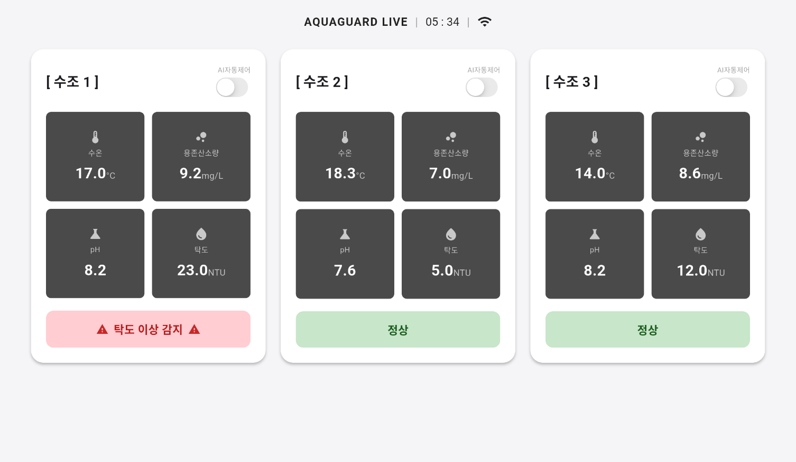
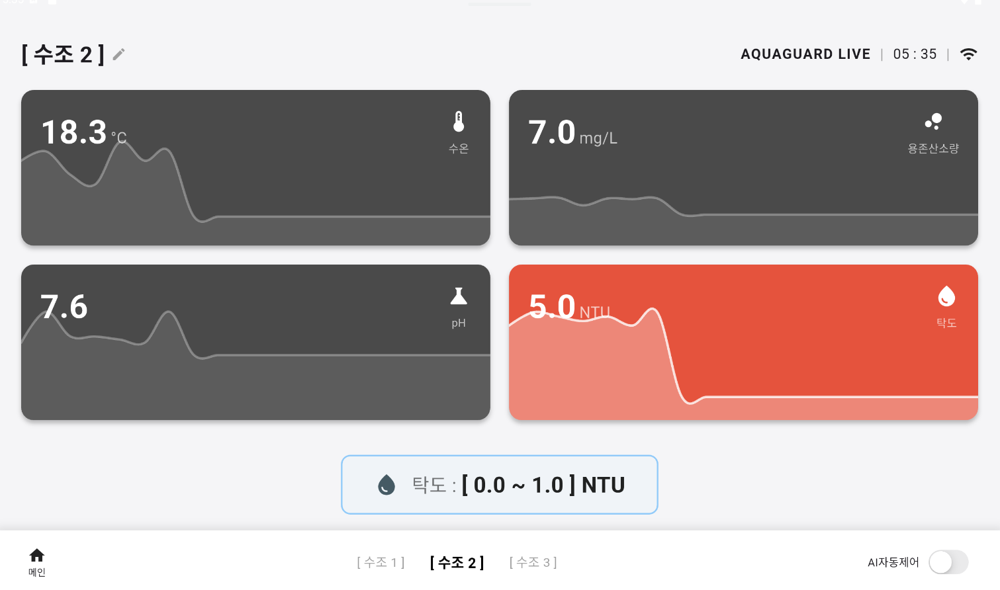

# AquaGuard — 활어차 수조 실시간 모니터링 앱

활어차에 탑재된 수조의 수질 센서 데이터를 실시간으로 수집·표시하는 Flutter 기반 크로스플랫폼 앱입니다.  
Android / iOS 환경을 모두 지원하며, 이상 수치 경보 및 AI 자동제어 토글 기능을 제공합니다.

---

## 화면 미리보기

| 메인 페이지 | 상세 페이지 |
|:-----------:|:-----------:|
|  |  |

---

## 주요 기능

### 메인 페이지
- 등록된 모든 수조를 카드 그리드로 표시
- 수조별 **수온 / 용존산소량 / pH / 탁도** 실시간 값 표시
- 임계값 이탈 시 카드 하단에 **이상 경보 메시지** 표시 (정상: 초록 / 이상: 빨강)
- 설정 가능한 **폴링 주기** (기본 1초)로 자동 데이터 갱신

### 상세 페이지
- 센서 4종 각각에 대한 **시계열 라인 차트** (최근 20개 데이터 포인트)
- 차트 탭 전환으로 원하는 센서 선택
- **정상 범위(최솟값 ~ 최댓값) 설정** 다이얼로그 — 설정값은 로컬에 영구 저장
- 차트 내 임계값 기준선(초록 / 빨강) 시각화

---

## 기술 스택

| 영역 | 사용 기술 |
|------|-----------|
| 프레임워크 | Flutter 3 (Dart 3) |
| 상태 관리 | Provider (ChangeNotifier) |
| 차트 | fl_chart |
| 로컬 저장소 | shared_preferences |
| 네트워크 감지 | connectivity_plus |
| HTTP 클라이언트 | Dio |

---

## 프로젝트 구조

```
lib/
├── main.dart                     # 앱 진입점, Provider 등록
├── core/
│   ├── api/api_client.dart       # Mock HTTP 클라이언트
│   ├── constants/app_constants.dart  # API 기본 주소, Mock 플래그
│   └── theme/app_theme.dart      # 전역 색상 상수
├── models/
│   └── tank_model.dart           # TankModel, TankHistoryModel
├── services/
│   └── api_service.dart          # ApiService 인터페이스 + MockApiService
├── providers/
│   ├── app_state_provider.dart   # 현재 시각, 네트워크 상태
│   └── tank_provider.dart        # 수조 데이터, 폴링, 임계값, 이력
├── views/
│   ├── main_page.dart            # 메인 화면 (수조 그리드)
│   └── detail_page.dart          # 상세 화면 (그래프 + 설정)
└── widgets/
    ├── header.dart               # AppBar 헤더 위젯
    ├── sensor_card.dart          # 센서 값 표시 카드
    └── sensor_graph_card.dart    # 센서 그래프 카드
```

---

## 모니터링 센서

| 센서 | 단위 | 기본 정상 범위 |
|------|------|---------------|
| 수온 | °C | 10 ~ 30 |
| 용존산소량 | mg/L | 5 ~ 15 |
| pH | — | 6.0 ~ 8.5 |
| 탁도 | NTU | 0 ~ 15 |

> 정상 범위는 상세 페이지에서 수조별로 개별 설정 가능하며, 재시작 후에도 유지됩니다.

---

## 시작하기

### 요구사항

- Flutter SDK `^3.9.2`
- Android SDK 또는 Xcode (iOS 빌드)

### 설치 및 실행

```bash
# 의존성 설치
flutter pub get

# 앱 실행 (Mock 모드)
flutter run
```

> 현재 `AppConstants.useMockData = true`로 설정되어 있어 실제 API 없이도 동작합니다.  
> 실제 서버 연동 시 `app_constants.dart`의 `baseUrl`과 `useMockData` 값을 수정하세요.

### 빌드

```bash
# Android APK
flutter build apk --release

# iOS (macOS 필요)
flutter build ios --release
```

---

## Mock 데이터 안내

`MockApiService`는 3개의 수조(`uuid-001` ~ `uuid-003`)를 시뮬레이션하며  
각 수조마다 고정된 센서 값과 20개 포인트의 이력 데이터를 반환합니다.  
실제 API 응답은 동일한 `ApiService` 인터페이스를 구현하면 바로 교체 가능합니다.
